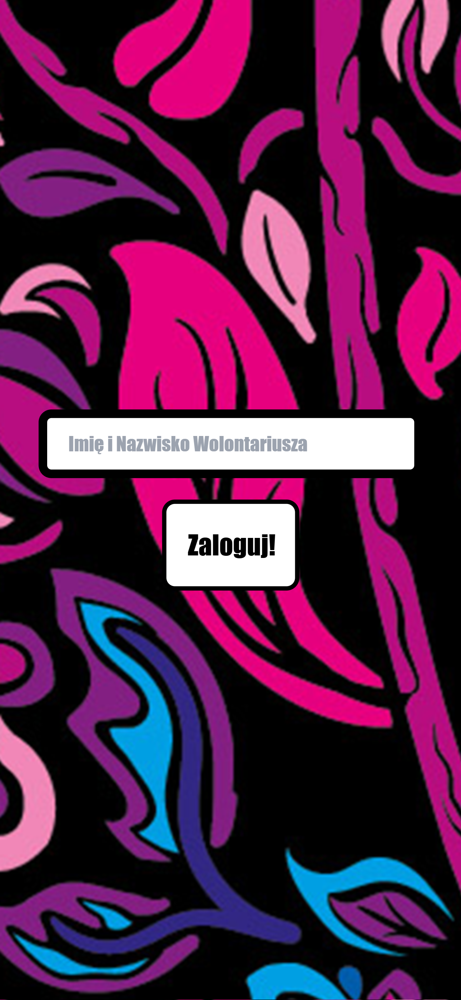
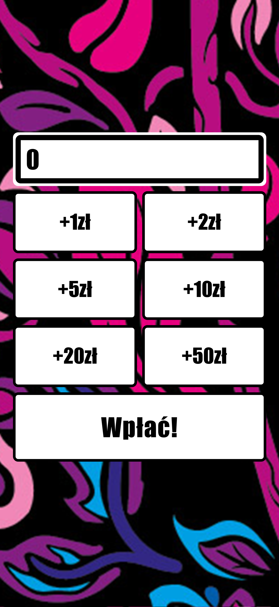
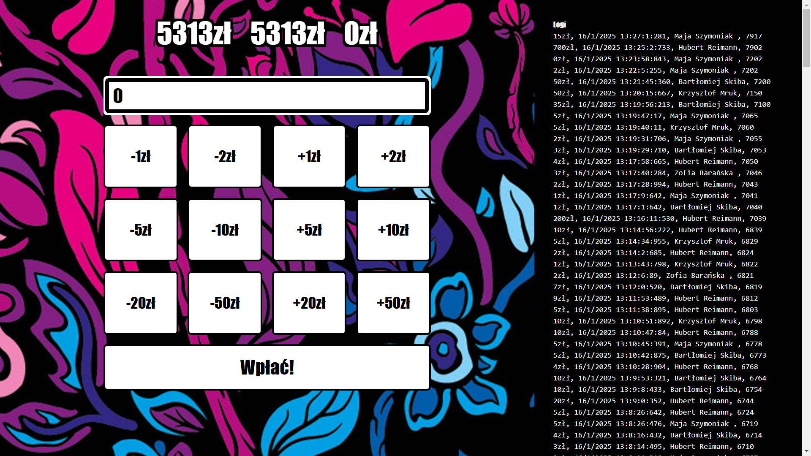

# WOŚP Live Counter

WOŚP Live Counter is a real-time donation tracker created to count money during the annual Grand Finale of the Great Orchestra of Christmas Charity (WOŚP) at my school, [Zespół Szkół Technicznych in Ostrów Wielkopolski](https://bis.zst-ostrow.edu.pl/). The project turned out so well that it was later used multiple times during the city-wide [Ostrow WOŚP Final at the Ostrowskie Centrum Kultury](https://wosp-ostrow.pl/).

## Where It Was Used
- **[32nd WOŚP Grand Finale at ZST](https://www.youtube.com/live/9m8vbj4bOPI)**
- **32nd WOŚP Grand Finale in Ostrów**
- **[33rd WOŚP Grand Finale at ZST](https://www.youtube.com/live/CoIn-BcCqNE)**
- **[33rd WOŚP Grand Finale in Ostrów](https://www.youtube.com/live/5IHqyxZnr4Y)**

## Why I Created It
I support the **Great Orchestra of Christmas Charity** because, as a child, I personally received help from this foundation. This project is my way of giving back and helping raise more funds for those in need.

## How It Works
The application runs a **Node.js server** and a **Vite development environment** (`npm run dev`) on `localhost`. Volunteers with collection boxes press a button on their mobile devices to add the received amount to the **large counter displayed on the auditorium screen and live broadcast**. Additionally, the app fetches real-time data from an **e-Skarbonka (online donation box)**, which is configurable via an `.env` file.

## Screenshots







## Tech Stack

Vue.js, Vite.js, TailwindCSS, Anime.js, <span>Socket.IO</span>, Node.js, Express, Puppeteer


<br />
<br />

## Installation & Setup
1. Clone the repository:
   ```sh
   git clone https://github.com/trzmlel/wosp-live-counter.git
   cd wosp-live-counter
   ```
2. Install dependencies:
   ```sh
   npm install
   ```
3. Edit an `.env` file and configure your settings:
   ```env
    VITE_LOCAL_IP=http://192.168.1.0
    VITE_ESKARBONKA=https://eskarbonka.wosp.org.pl/cezecyfalu
   ```
4. Start the server:
   ```sh
   node server.cjs
   ```
5. Start the application:
   ```sh
   npm run dev -- --host
   ```
6. Open `localhost:5137` in your browser and start tracking donations!

| URL                         | Description |
|-----------------------------|-------------|
| `localhost:5137/`           | Login page for volunteers |
| `localhost:5137/sum`        | Total amount displayed on a billboard or live stream |
| `localhost:5137/eskarbonka` | Page with a QR code for the eSkarbonka |
| `localhost:5137/admin`      | Admin panel with logs and the ability to add or subtract from the main total |

---
This project is a tribute to **WOŚP** and all the amazing volunteers making a difference. ❤️